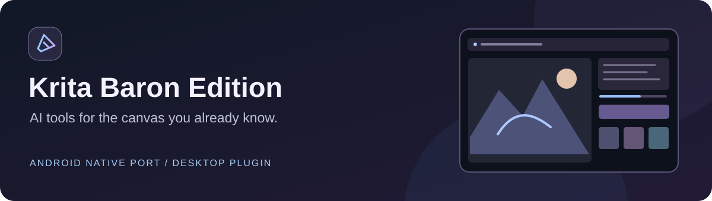

# Krita Baron Edition

Paint, generate, edit and refine in the same canvas. A native **C++/Qt Android port**
of [Acly's Krita AI Diffusion](https://github.com/Acly/krita-ai-diffusion), with a
companion desktop fork. The Android panel runs inside Krita without a Python
interpreter; inference runs on a remote backend.

[Русский](README.ru.md) · [Downloads](https://github.com/Darxarz/krita-baron-android/releases/tag/v0.1.36)
· [What is still missing?](docs/CURRENT_PARITY.md) · [Build from source](docs/BUILD.md)

## Download

| Platform | Package | Installation |
| --- | --- | --- |
| Android 7+ · ARM64 | **[Krita Baron Edition 0.1.36 APK](https://github.com/Darxarz/krita-baron-android/releases/download/v0.1.36/krita-baron-android-arm64-v0.1.36.apk)** | Install the APK; the AI panel is built in. |
| Windows · Krita 5.x / Qt5 | **[AI Diffusion Baron 1.53.0-baron.16 ZIP](https://github.com/Darxarz/krita-ai-diffusion-baron-edition/releases/download/v1.53.0-baron.16/krita_ai_diffusion-1.53.0-baron.16.zip)** | Import it as a Python plugin, then restart Krita. |
| Complete modified source | [Krita + native port + public fonts](https://github.com/Darxarz/krita-baron-android/releases/download/v0.1.36/krita-baron-edition-v0.1.36-source.zip) | Corresponding source for the Android APK. |

The Android edition is a **preview port** based on stable **Krita 5.3.4 / Qt5**.
It has its own application identity and can coexist with official Krita. Current
packages include 96 licensed public font families; private Windows fonts are not
included. Release assets include SHA-256 checksums.

## Familiar controls, tablet-friendly interaction

- Generate, refine or edit the canvas or a selection, with a denoise slider and
  automatic document dimensions.
- Custom inpainting: Seamless, Focus, pre-fill and selection/image/mask-layer context.
- Control layers and references, server preprocessors, regional prompts and masks.
- Tiled diffusion upscale and foreground extraction with editable masks.
- Results below the prompt: tap to preview, tap empty space to compare, apply to a
  real layer. Touch scrolling has inertia; thumbnails stay in fixed positions.
- Generation history in documents, desktop-history interoperability and saved styles.
- Full-screen model/LoRA browser, folders, tags, trigger words, model information
  and persistent thumbnail caching, where the backend provides metadata.
- Prompt completion, prompt actions, separate generation/edit prompt and style banks,
  and optional A1111 prompt syntax/GPU noise on compatible backends.
- Portrait/landscape dock layouts, theme-aware UI, localization and in-app updates.

Core mechanisms are implemented, but this is **not yet a complete port of every
Python-plugin workspace**. Live, Animation, Custom/Graph and remaining differences
are documented in the [current parity report](docs/CURRENT_PARITY.md).

## Start using it

**Android:** install the APK, open the AI Diffusion Baron Edition docker and choose
Connection. Use a supported remote backend; direct ComfyUI requires the
[server-side workflow helper](server/comfyui-baron-native/README.md). Models stay on
the inference machine.

**Desktop:** in Krita, choose **Tools → Scripts → Import Python Plugin from File**,
select the ZIP and restart. Enable the plugin in **Settings → Configure Krita →
Python Plugin Manager**, then open its docker. This uses the original `ai_diffusion`
plugin identifier and replaces an existing installation of that plugin.

ComfyUI, Interstice and compatible custom-server connections are available. Backend
model support and native-API configuration determine which features can run.

## Project and development

| Area | Location |
| --- | --- |
| Native widgets and network clients | [`native/`](native/) |
| Krita documents, layers, masks and preview | [`krita/`](krita/) |
| Android integration | [`android/`](android/) |
| Original workflow engine and adapters | [`server/`](server/) |
| Build and packaging | [`scripts/`](scripts/) · [build guide](docs/BUILD.md) |
| Regression tests | [`tests/`](tests/) |

The v0.1.36 automated checks passed 124 Qt tests on Linux,
25 Python engine/bridge tests and 32 context-geometry cases against the original
Python functions. These checks do not substitute for tablet and real-inference
validation. [Release notes](docs/RELEASE_0_1_36.md).

Bug reports and contributions are welcome: [issues](https://github.com/Darxarz/krita-baron-android/issues),
[contributing](CONTRIBUTING.md), [desktop fork](https://github.com/Darxarz/krita-ai-diffusion-baron-edition).

## Credits and license

**Acly and contributors** created Krita AI Diffusion. **The Krita team and
contributors** created Krita. **Darxarz / Baron Edition** provides this independent
Android port and modifications. Original authorship, icons, translations and
license notices are retained; this edition is not an official Acly or Krita release.

[Original plugin](https://github.com/Acly/krita-ai-diffusion) ·
[Original handbook](https://docs.interstice.cloud) ·
[GPL-3.0-or-later](LICENSE) · [Third-party notices](THIRD_PARTY_NOTICES.md)
