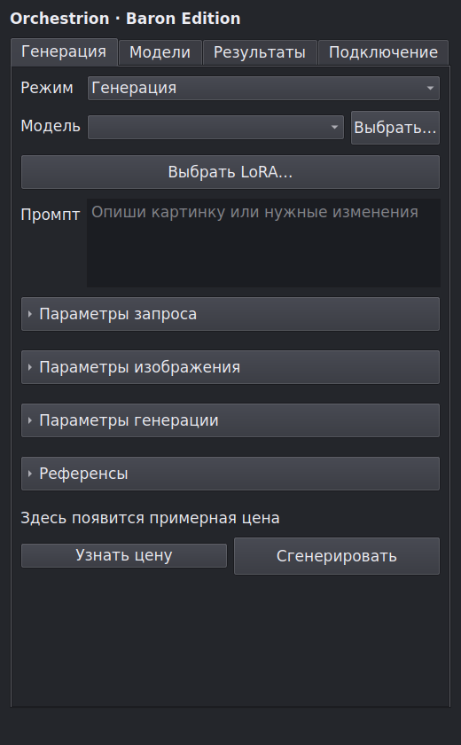
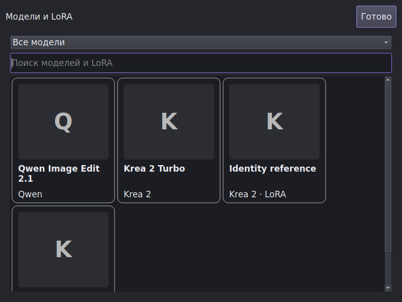

# Krita AI Diffusion — Baron Edition for Android

Отдельный проект для Android Krita: нативная панель C++/Qt подключается к
Оркестриону. Python не встраивается в APK. Сборщик workflow работает на сервере
и использует зафиксированную копию движка настольного Baron Edition.

## Возможности первой версии

- Вход через браузер с явным подтверждением подключения на сайте.
- Баланс и оценка стоимости только в bleatbucks / беелетиках.
- Генерация, редактирование текущего холста и выделения, апскейл,
  отделение персонажа от фона. Стул по умолчанию считается фоном.
- Референсы Qwen 2.1 / Krea 2, настройки identity/style и выбор LoRA.
- Полноэкранная галерея основных моделей и LoRA, поиск по имени,
  картинки с постепенной загрузкой, настройка силы LoRA.
- Раскрывающиеся разделы настроек и цвета текущей темы Krita.
- Результаты добавляются в новые слои; у вырезанного персонажа остаётся
  редактируемая маска. Исходные слои скрываются с возможностью отмены.
- Зашифрованное хранение ключа устройства через Android Keystore.

Это первый нативный перенос, а не полная копия всех рабочих пространств
настольного плагина. Live, Animation, Custom Graph и расширенные ControlNet
панели пока не перенесены. Русский и английский интерфейс переведены полностью;
остальные 12 языков используют существующие переводы и английский для новых строк.

## Статус

Актуальные результаты сборки и проверки находятся в [docs/STATUS.md](docs/STATUS.md).
Самостоятельная программа `baron_preview` предназначена только для проверки UI:
это не Krita и не готовый Android APK.

Первый полноценный APK собран отдельно: `krita-baron-android-arm64-v0.1.0-preview.apk`,
около 173 МиБ, Android 7+ / ARM64. Его подпись и состав проверены; запуск на
реальном планшете ещё не проверен. Сборка основана на Krita 5.4.0-prealpha.

Ниже — UI-превью нативной панели. Галерея показывает демонстрационные названия
и заглушки картинок, а не подключение к рабочему сайту.

Рабочий сайт не изменяется и не перезапускается этим проектом. Для подключения
нужен серверный маршрут `/api/krita/native/prepare`; подготовленные изменения
находятся в [orchestrion-integration](orchestrion-integration), в отдельной ветке
сайта. До их интеграции нативная генерация на рабочем сайте недоступна.

## Сборка и устройство проекта

- [Сборка APK](docs/BUILD.md)
- [Подключение серверной части](docs/SERVER.md)
- `native/` — Qt UI и HTTP-клиент.
- `krita/` — адаптер документов, слоёв и масок Krita.
- `android/` — Android Keystore.
- `server/` — компиляция workflow без запуска GPU.
- `server/vendor/SNAPSHOT.json` — SHA-256 исходников движка Baron `.3`.
- `tests/` — проверки клиента, галереи и workflow на сохранённых метаданных.

Исходники распространяются под GPL-3.0-or-later. Krita, движок Acly/Baron
и вложенные библиотеки сохраняют собственные уведомления об авторских правах.
Базовый код Krita скачивается из KDE отдельно; этот репозиторий содержит надстройку.
